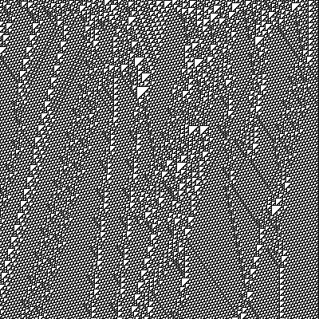

# c110 - A compiler for a [rule-110](http://mathworld.wolfram.com/Rule110.html) virtual machine

## Inspiration

* [Matthew Cook's original constructive proof of how rule110 can simulate a turing machine](http://www.complex-systems.com/pdf/15-1-1.pdf)
* [His descriptive paper of how to do it](https://arxiv.org/pdf/0906.3248.pdf)

## Premise

* A rule-110 emulator simulates a turing machine which
* Simulates a simple virtual machine which
* Runs your compiled program
